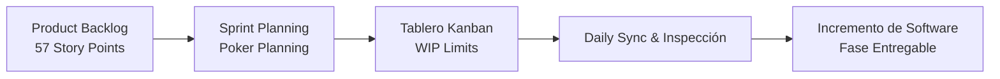
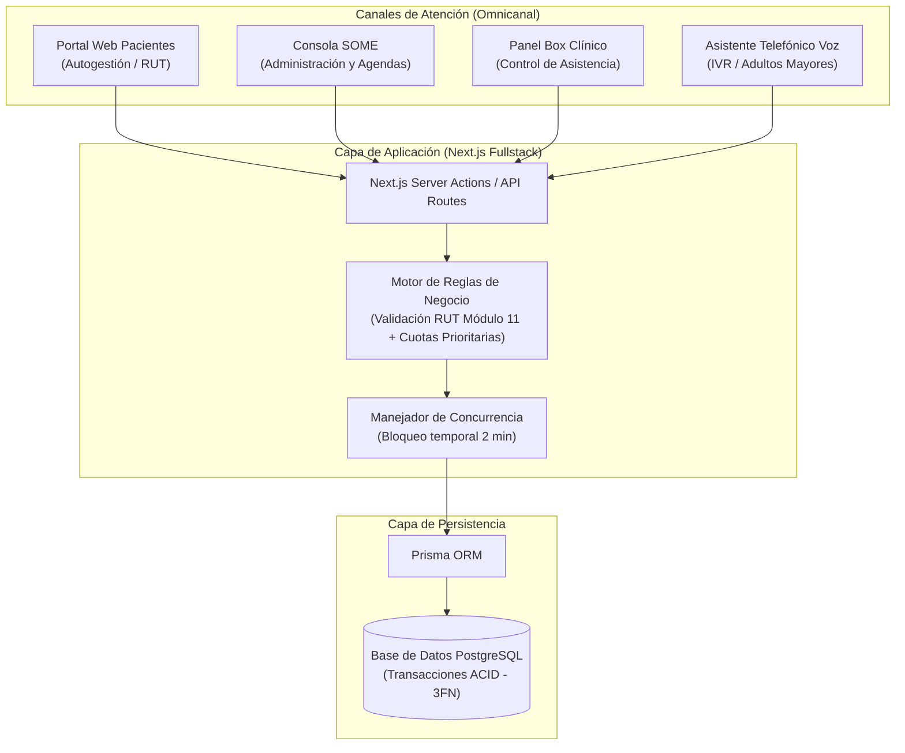

# MALLASALUD

> **Sistema integral y omnicanal para la gestión, distribución y reserva de horas médicas en Centros de Salud Pública Primaria (CESFAM, SAPU y consultorios).**

[](https://nextjs.org/)
[](https://react.dev/)
[](https://www.typescriptlang.org/)
[](https://tailwindcss.com/)
[](https://www.postgresql.org/)
[](https://www.prisma.io/)
[](https://www.docker.com/)

---

## Descripción del Proyecto

**MALLASALUD** nace como respuesta a la problemática en la salud pública chilena y la brecha digital que afecta a los adultos mayores con respecto a la reserva de horas médicas.

El sistema proporciona una plataforma omnicanal que sincroniza en tiempo real las agendas de especialidades médicas clave (Medicina General, Urgencia Dental y Matronería), garantizando cuotas prioritarias para adultos mayores y permitiendo la reserva por ventanilla presencial, pagina web y por via telefonica.

---

## Integrantes del Equipo y Roles

| Integrante | Rol Principal | Especialización y Responsabilidades |
| :--- | :--- | :--- |
| **Benjamín Ascencio** | **Backend Developer & Datos** | • Modelado relacional normalizado e integridad referencial.<br>• Persistencia con PostgreSQL y Prisma ORM.<br>• Lógica transaccional y concurrencia.<br>• Documentación técnica. |
| **Pablo Carrasco** | **Frontend Developer & Interfaces** | • Arquitectura de componentes e interfaz reactiva con Next.js y React.<br>• Sistema de diseño inclusivo y responsivo con Tailwind CSS.<br>• Accesibilidad y usabilidad orientada a adultos mayores.<br>• Desarrollo de interfaces: Portal Paciente, Consola SOME y Panel Box Médico. |

* **Carrera:** Ingeniería en Informática — **Institución:** Duoc UC Alameda  
* **Asignatura:** Proyecto Capstone (APT122) — **Docente Guía:** Felipe Krauss  

---

## Tecnologías Utilizadas

### Frontend
* **[Next.js (App Router)](https://nextjs.org/):** Framework React para renderizado del lado del servidor (SSR), generación estática y Server Actions.
* **[React](https://react.dev/):** Biblioteca para construcción de componentes modulares y reactivos.
* **[Tailwind CSS](https://tailwindcss.com/):** Framework utilitario para diseño responsivo, accesible y de alta coherencia visual.
* **[Lucide React](https://lucide.dev/):** Iconografía moderna y accesible.

### Backend y Lógica de Negocio
* **[Node.js](https://nodejs.org/) & [TypeScript](https://www.typescriptlang.org/):** Entorno de ejecución con tipado estricto para lógica de dominio y Server Actions/API Routes.
* **Algoritmo Módulo 11:** Validación estricta de RUT chileno en backend y frontend.
* **Gestión de Concurrencia Temporal:** Mecanismo transaccional para retención temporal de cupos con expiración automática de 2 minutos para evitar colisiones entre canales.

### Base de Datos y Persistencia
* **[PostgreSQL 16](https://www.postgresql.org/):** Motor de base de datos relacional para garantizar aislamiento transaccional (ACID).
* **[Prisma ORM](https://www.prisma.io/):** Modelado de datos declarativo, migraciones estructuradas y consultas seguras tipadas.

### Infraestructura, DevOps y Herramientas
* **[Docker](https://www.docker.com/) & [Docker Compose](https://docs.docker.com/compose/):** Contenedorización de aplicación y base de datos para despliegue y desarrollo homogéneo.
* **[Faker.js](https://fakerjs.dev/):** Generación de datos sintéticos realistas con población chilena de prueba.
* **Git & GitHub Projects:** Control de versiones distribuido y gestión de tableros ágiles.

---

## Metodología de Trabajo

El equipo implementa un marco de trabajo **Scrumban**, combinando la flexibilidad iterativa de **Scrum** con la eficiencia y visibilidad del flujo continuo de **Kanban**:



### Principales Prácticas Metodológicas:
1. **Sprints Iterativos e Incrementales:** Ciclos enfocados en entregas funcionales de valor y pruebas continuas.
2. **Tablero Kanban (GitHub Projects):** Control visual del flujo de trabajo dividido en *Backlog, To Do, In Progress, Review* y *Done*, controlando el límite de trabajo en curso (WIP).
3. **Poker Planning:** Estimación colaborativa de esfuerzo, complejidad e incertidumbre basada en la secuencia Fibonacci, totalizando **57 Puntos de Historia / Función** repartidos en 14 actividades técnicas de alta cohesión.
4. **Plan de Trabajo en 3 Fases (18 Semanas):**
   * **Fase 1 (Semanas 1 a 4) - Definición:** Requisitos, diseño arquitectónico, esquemas relacionales 3FN y validación de reglas de negocio.
   * **Fase 2 (Semanas 5 a 15) - Desarrollo:** Construcción concurrente de Frontend, Backend/APIs, Consola SOME, Portal Pacientes y canal telefónico de voz.
   * **Fase 3 (Semanas 16 a 18) - Pruebas y Cierre:** Pruebas de estrés y concurrencia, CI/CD, manuales técnicos de despliegue y cierre formal.

---

## Arquitectura de la Solución

MALLASALUD implementa una **arquitectura omnicanal desacoplada y modular** diseñada para atender múltiples puntos de contacto simultáneos sobre un núcleo transaccional unificado:



### Capas del Sistema:
* **Capa de Canales (Presentación):**
  * *Portal Pacientes:* Búsqueda ágil y reserva de citas con validación de RUT y cuotas prioritarias (+60 años).
  * *Consola SOME:* Apertura vespertina y distribución dinámica de cupos protegidos.
  * *Panel Box Médico:* Marcado de asistencia clínica (`ATENDIDA` o `NO_ASISTE`) y liberación inmediata de cupos ociosos.
  * *Canal Telefónico de Voz:* Microservicio/Webhook para reservas telefónicas automatizadas sin requerir smartphone.
* **Capa de Lógica y Servicios (Next.js Server):** Procesamiento de reglas de negocio, validación criptográfica de identidad y temporizador de bloqueo de cupos para evitar colisiones entre canales.
* **Capa de Datos:** PostgreSQL en tercera forma normal (3FN) con aislamiento transaccional para operaciones críticas de asignación de horas médicas.

---

## Requisito Único en el PC

Para ejecutar el proyecto solo se necesita tener instalado y abierto:
* **[Docker Desktop](https://www.docker.com/products/docker-desktop/)** *(Compatible con Windows, Mac y Linux)*.

> *No requiere instalar Node.js ni PostgreSQL directamente en la máquina anfitriona.*

---

## Paso a Paso para Ejecutar

### 1. Entrar a la carpeta del proyecto
Abra una terminal en la raíz del repositorio y ejecute:
```bash
cd mallasalud
```

### 2. Crear archivo de entorno `.env`
* En **Windows (PowerShell)**: `Copy-Item .env.example .env`
* En **Windows (CMD)**: `copy .env.example .env`
* En **Mac / Linux**: `cp .env.example .env`

*(O simplemente duplique `.env.example` y renómbrelo como `.env`)*.

### 3. Levantar la aplicación con Docker
```bash
docker compose up --build
```
> *Espere 1 a 2 minutos la primera vez mientras se descargan las imágenes y se compila el proyecto.*

### 4. Crear tablas y cargar datos de prueba (`seed`)
En **otra terminal** (dentro de la carpeta `mallasalud`):
```bash
docker compose exec app npm run db:setup
```
*(O manualmente: `docker compose exec app npx prisma db push` y luego `docker compose exec app npm run db:seed`)*.

---

## Enlaces de Acceso

| Servicio | Enlace | Descripción |
| :--- | :--- | :--- |
| **Aplicación Web** | [http://localhost:3000](http://localhost:3000) | Sistema de reserva y gestión de citas |
| **Base de Datos (Prisma Studio)** | [http://localhost:5555](http://localhost:5555) | Explorador visual de tablas y registros |

> *Para abrir el explorador de Base de Datos en el navegador, ejecute:*
> ```bash
> docker compose exec app npm run db:studio
> ```

---

## Datos de Demostración (`seed`)

El sistema incluye datos chilenos precargados y listos para evaluación:

* **Administrativo SOME:** `15432890-K` (Carolina Soto)
* **Médico General:** `16789452-3` (Matías Valenzuela)
* **Urgencia Dental:** `14238910-5` (Valeria Rojas)
* **Matronería:** `17890123-1` (Fernanda Morales)
* **Pacientes:** 15 adultos mayores (cupos prioritarios) y 25 adultos generales con RUTs chilenos válidos.
* **Cupos y Citas (Hoy y Mañana):**
  - **Disponibles:** Horas libres listas para ser reservadas.
  - **En proceso de tomarse (Inactivas / Retenidas temporalmente):** Cupos con `bloqueadoHasta` y `bloqueadoPorRut` que simulan pacientes en pleno flujo de confirmación.
  - **Tomadas:** Citas confirmadas en Box (`RESERVADA` y `ATENDIDA`) asociadas al profesional de salud, paciente y observaciones clínicas.

---

## Detener la aplicación

Presione `Ctrl + C` en la terminal o ejecute:
```bash
docker compose down
```
